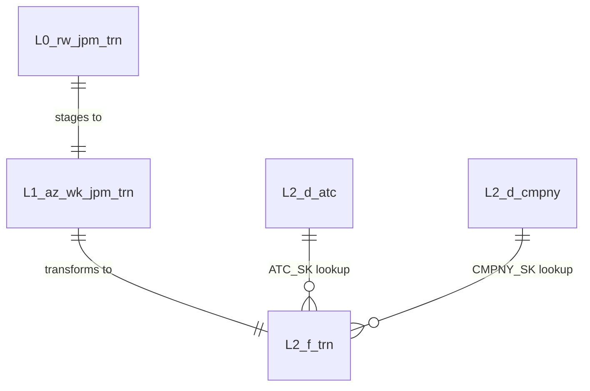

# ER DIAGRAM SPECIFICATION

## PURPOSE
One ER Diagram per run, covering ALL layers. Provides lineage visibility for high-level consumers. The workbook is generated from the canonical template `.claude/skills/design-agent/templates/workbooks/ER_DIAGRAM_TEMPLATE.xlsx`; this markdown file defines the sheet/content contract.

## WORKBOOK STRUCTURE: 4 Sheets

### Sheet 1: `table_tracker`

Tracks the ER workbook sheets and their purpose. Preserve this sheet from the canonical template and update it if sheet names or comments change.

Required columns:

| Column | Header | Description |
|--------|--------|-------------|
| A | S. No. | Sequence number |
| B | Sheet Name | ER workbook sheet name |
| C | Comments | Sheet purpose/notes |

### Sheet 2: `lineage_overview`

One row per table across all layers.

| Column | Header | Description |
|--------|--------|-------------|
| A | Layer | Layer identifier (L0, L1, L2, ...) |
| B | Table Name | Target table name |
| C | Table Type | dimension, fact, reference, cross_reference, bridge, staging, raw |
| D | Source Tables | Comma-separated list of tables this table reads from (with layer prefix) |
| E | Key Columns | Comma-separated list of PK and BK column names |
| F | Column Count | Total number of columns in this table |
| G | Description | Table description |
| H | References | Row-level evidence references supporting the table lineage entry |

Sort by: Layer (ascending), then Table Name (alphabetical).

### Sheet 3: `table_relationships`

One row per relationship between tables.

| Column | Header | Description |
|--------|--------|-------------|
| A | From Layer | Source layer |
| B | From Table | Source table name |
| C | From Column | Source column name |
| D | Relationship Type | `FK` (foreign key), `Lookup` (SK lookup), `Direct` (1:1 mirror), `Derived` (computed from) |
| E | To Layer | Target layer |
| F | To Table | Target table name |
| G | To Column | Target column name |
| H | References | Evidence references supporting the relationship |

Includes same-layer semantic relationships (for example fact-to-dimension FK relationships) and cross-layer lineage relationships. It must not imply unapproved same-layer physical transformation dependencies.

### Sheet 4: `layer_diagram_data`

One row per column per table — flat structure suitable for rendering in any diagramming tool.

| Column | Header | Description |
|--------|--------|-------------|
| A | Entity Name | Table name |
| B | Layer | Layer identifier |
| C | Attribute Name | Column name |
| D | Data Type | Column data type |
| E | PK | Y or N |
| F | FK | Y or N (is this column a foreign key reference?) |
| G | FK Reference | If FK=Y: `table_name.column_name` it references. Blank if FK=N. |
| H | References | Evidence references supporting the attribute and FK designation |

### Optional: Mermaid Diagram

If feasible, also generate `outputs/ER_DIAGRAM.mmd` containing a Mermaid ER diagram:

This is a nice-to-have, not required. The Excel workbook is the primary deliverable.

## TEMPLATE CLEANUP

Before writing current-run ER rows, remove all dummy/example/prototype detail rows from `lineage_overview`, `table_relationships`, and `layer_diagram_data` while preserving the `table_tracker`, summary rows 1-8, section title row 9, detail header row 10, formatting, widths, filters, and any template formulas.
